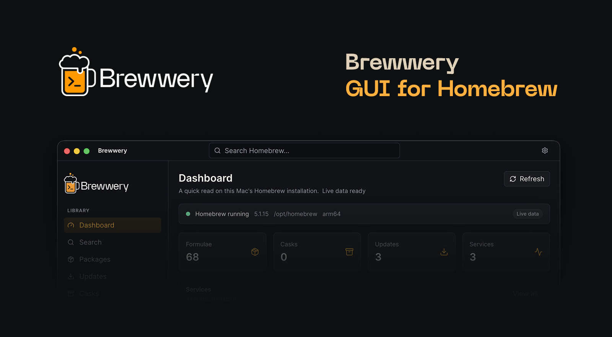

# Brewwery Docs

Documentation site for [Brewwery](https://www.brewwery.com) — macOS GUI for Homebrew.

Hosted at [docs.brewwery.com](https://docs.brewwery.com).



## Stack

- [Next.js 16](https://nextjs.org)
- [Nextra 4](https://nextra.site) (docs theme)
- Static export for deployment

## Development

```bash
npm install
npm run dev
```

Open [http://localhost:3000](http://localhost:3000).

## Build

```bash
npm run build
```

Static output is written to the `out/` directory, ready for deployment to any static hosting (Vercel, Cloudflare Pages, Netlify, etc.).

## Structure

```
docs/
├── app/                    # Next.js App Router layout
│   ├── layout.tsx          # Root layout (html, head, body)
│   └── [[...mdxPath]]/    # Catch-all route
│       ├── layout.tsx      # Nextra docs layout (navbar, sidebar, footer)
│       └── page.tsx        # MDX page renderer
├── content/                # MDX documentation pages
│   ├── _meta.ts            # Sidebar navigation order
│   ├── index.mdx           # Introduction
│   ├── getting-started.mdx
│   ├── features.mdx
│   ├── architecture.mdx
│   ├── security.mdx
│   ├── development.mdx
│   ├── roadmap.mdx
│   ├── changelog.mdx
│   ├── faq.mdx
│   └── contributing.mdx
├── public/                 # Static assets
│   └── og-image.png        # Open Graph image for social sharing
├── mdx-components.tsx      # MDX component configuration
├── next.config.mjs         # Next.js + Nextra config
├── tsconfig.json
└── package.json
```

## Deployment

The site exports as fully static HTML. Deploy the `out/` directory to any static hosting provider with a custom domain pointing to `docs.brewwery.com`.

## Repository

[github.com/brewwery/docs](https://github.com/brewwery/docs)

## License

MIT
