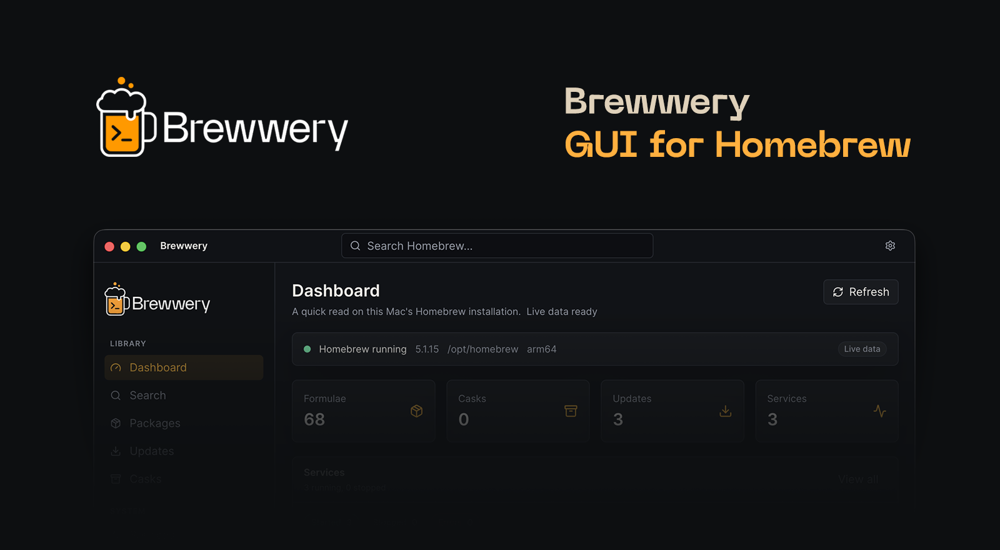

# Brewwery Docs

Documentation site for [Brewwery](https://www.brewwery.com) — the native macOS app for Homebrew.

The docs cover installing and using Brewwery 1.0, Homebrew basics and commands, troubleshooting, the security model, the Swift architecture, and development and release workflows.

Hosted at [docs.brewwery.com](https://docs.brewwery.com).



## Stack

- [Next.js 16](https://nextjs.org)
- [Nextra 4](https://nextra.site) (docs theme)
- Swift app screenshots in `public/screenshots`

## Development

```bash
npm install
npm run dev
```

Open [http://localhost:3000](http://localhost:3000).

## Build

```bash
npm run build
```

Pages are prerendered into `.next/`. Serve them with `npm start`.

## Structure

```
docs/
├── app/                    # Next.js App Router layout
│   ├── layout.tsx          # Root layout (html, head, body)
│   └── [[...mdxPath]]/    # Catch-all route
│       ├── layout.tsx      # Nextra docs layout (navbar, sidebar, footer)
│       └── page.tsx        # MDX page renderer
├── content/                # MDX documentation pages
│   ├── _meta.ts            # Sidebar navigation order
│   ├── index.mdx           # Introduction
│   ├── getting-started.mdx
│   ├── features.mdx
│   ├── what-is-homebrew.mdx
│   ├── brew-commands.mdx
│   ├── troubleshooting.mdx
│   ├── security.mdx
│   ├── architecture.mdx
│   ├── development.mdx
│   ├── roadmap.mdx
│   ├── changelog.mdx
│   ├── faq.mdx
│   └── contributing.mdx
├── public/                 # Static assets
│   ├── screenshots/        # App screenshots (dark and -Light variants)
│   └── og-image.png        # Open Graph image for social sharing
├── mdx-components.tsx      # MDX component configuration
├── next.config.mjs         # Next.js + Nextra config
├── tsconfig.json
└── package.json
```

## Deployment

Build with `npm run build` and serve with `npm start` behind the `docs.brewwery.com` domain.

Screenshots come from `Scripts/screenshots.sh` in the [app repository](https://github.com/brewwery/brewwery); copy the generated PNGs into `public/screenshots/`.

## Repository

[github.com/brewwery/docs](https://github.com/brewwery/docs)

## License

MIT
